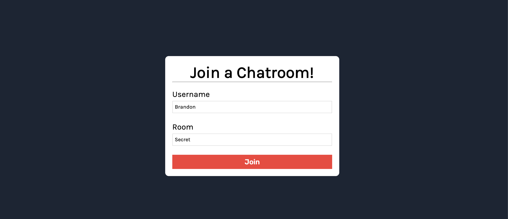
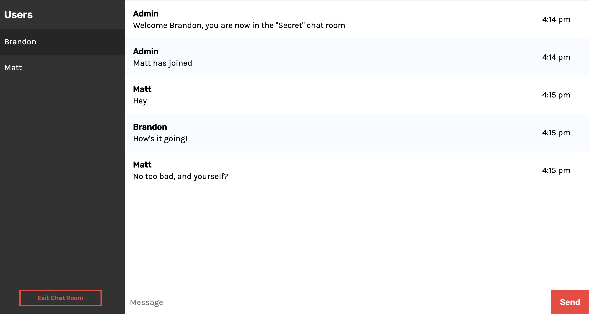

# Chat App

A chat application made with React and SocketIO

## Built With

### Front-End

- React
- SCSS  

[Atomic Design](http://bradfrost.com/blog/post/atomic-web-design/) component folder structure.

### Back-End
- NodeJS/Express 
- SocketIO 

## Functionality
### Join a Chat Room
Users can pick a username and join any room of their choosing.

### Talk to Users in the same Chat Room
Users that are in the same chat room are able to talk to each other. If users are in a different chat room, they will not be able to communicate.

## License
This project is licensed under the MIT License - see the LICENSE.md file for details
